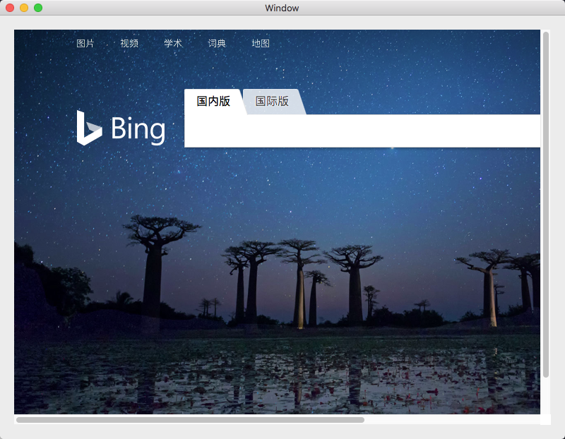

晚上开了一个新坑，准备写一个 macOS 应用。其中一个核心模块是一个内置浏览器。

了解到 macOS 上常用的浏览器组件是 MKWebView，就照着 Demo 开始编写。

最终的效果如下，一个简单的 WebView 组件：

中间遇到了一个小问题，就是加载百度的 url MKWebView 展示的是一个空白页。

这就是苹果的 ATS 政策，详情可以参考这篇[博客](https://onevcat.com/2016/06/ios-10-ats/)。

也就是说 MKWebView 默认只允许 https 地址，不允许 http 地址。

另外，一些不 https 协议合格的网页也是禁止的，比如百度。
